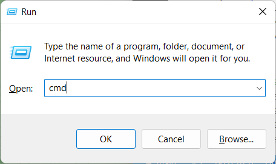
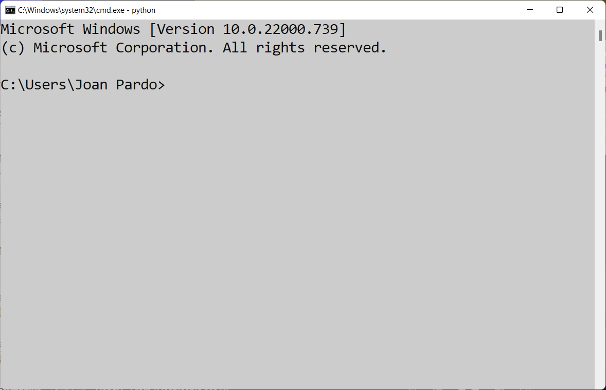
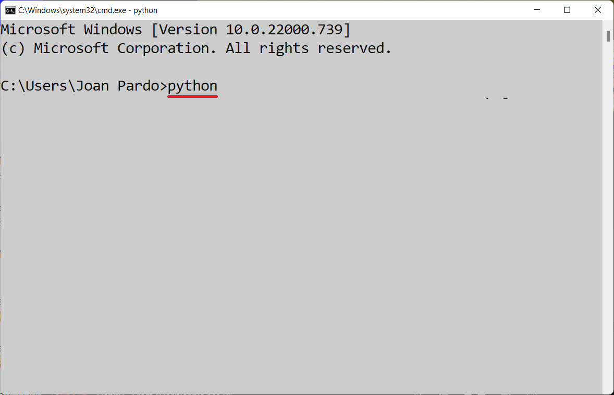
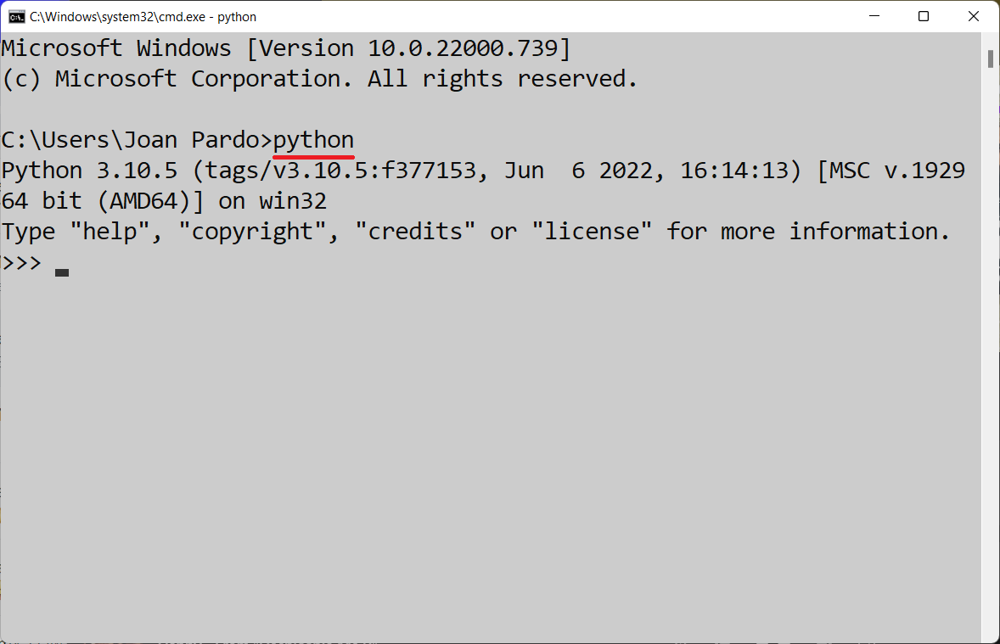
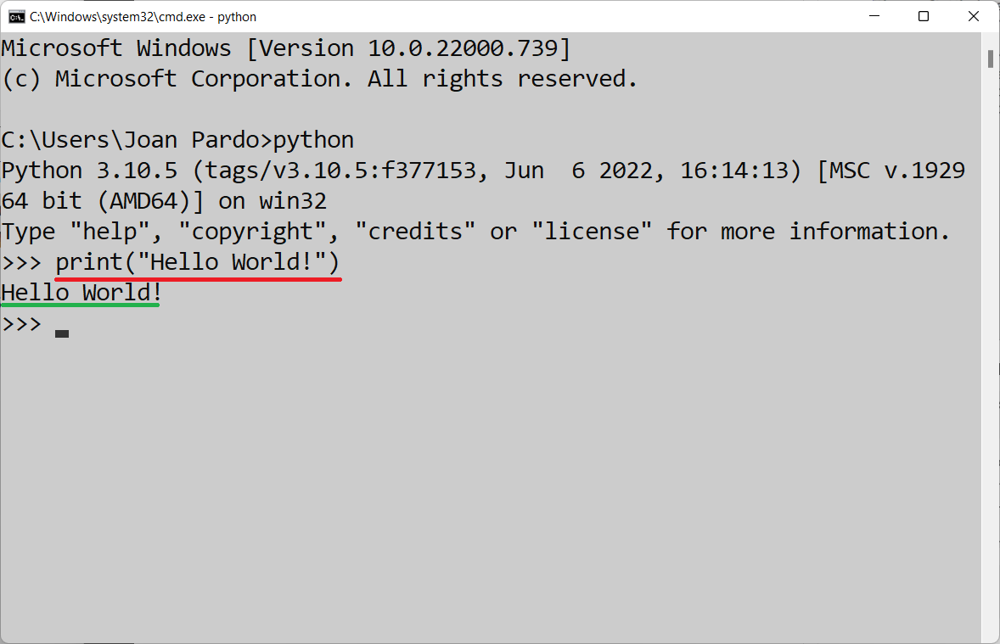
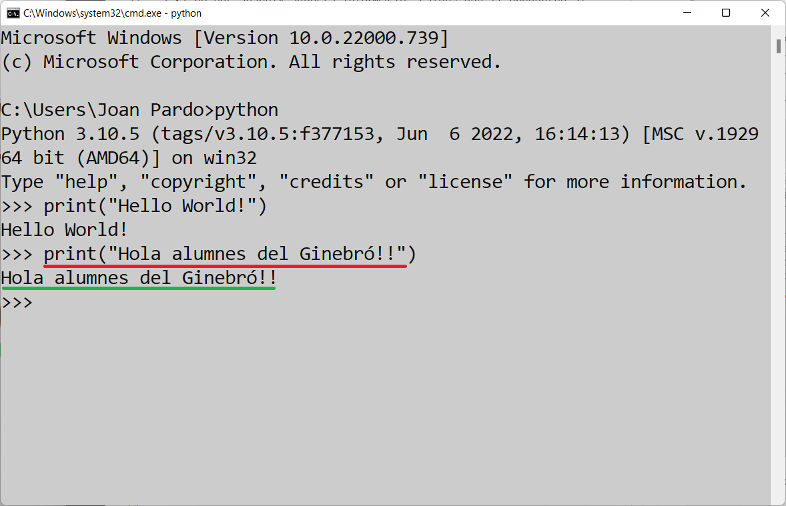
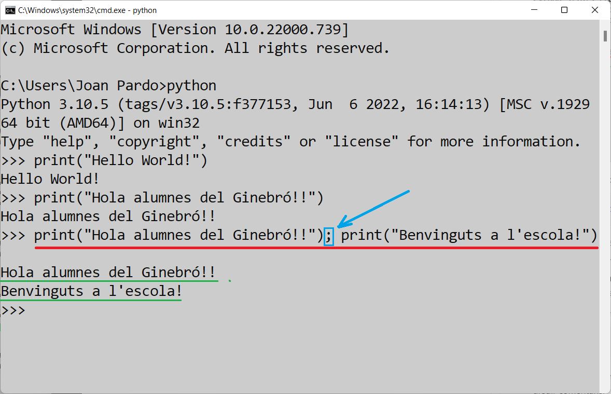
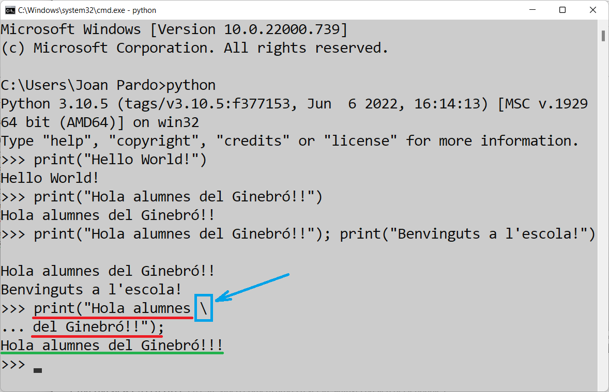
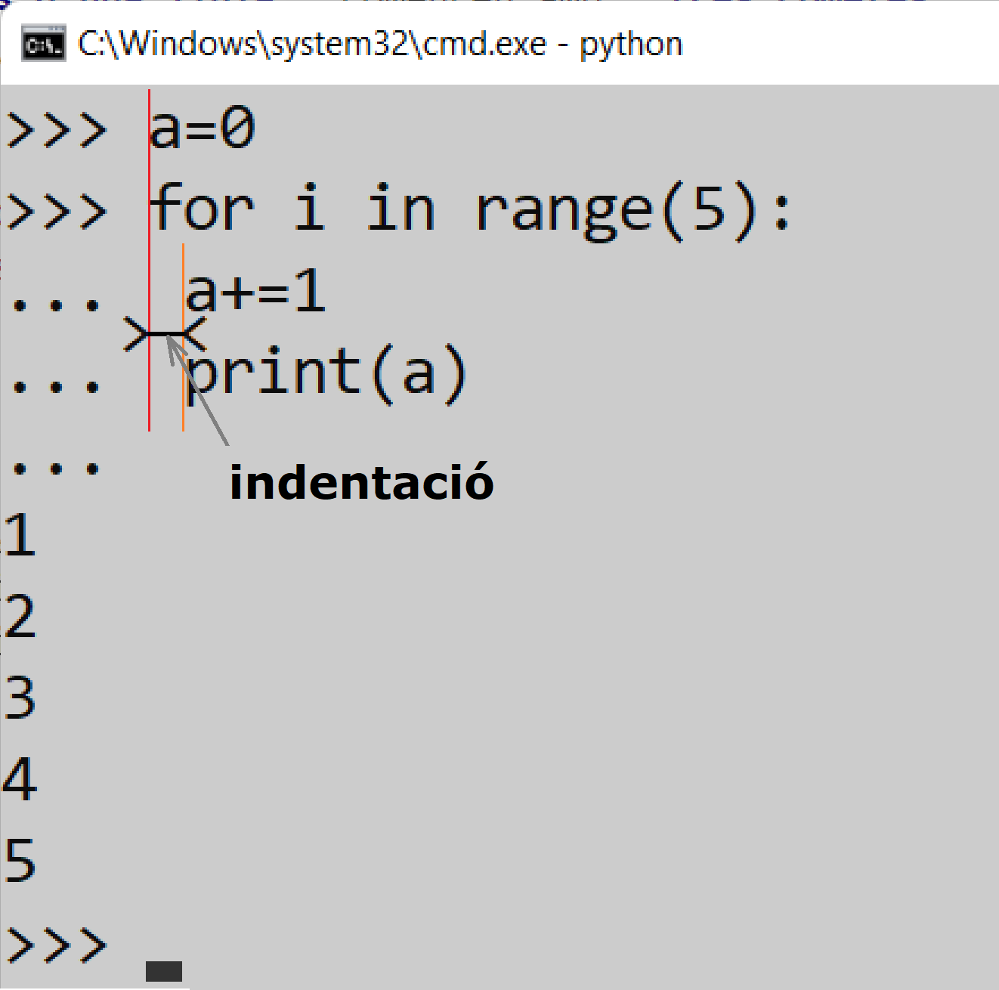

# Python

## Introducció

* [**Història**](./python_01_01_historia.md)


Per començar, no cal res més que tenir instal·lat python al nostre ordinador.

Per confirmar que el tenim correctament instal·lat podem, des de la consola d'ordres de Windows (**```cmd```**), executar el següent:



Un cop oberta la consola d'ordres de Windows



executarem el programa **```python```**.



I si el tenim ben instal·lat, ens apareixerà alguna cosa com el següent:



És a dir, se'ns obre la consola de  **```python```**.

> Si no ens apareix aquesta informació, caldrà que li pregunteu al professor que pot passar.

## La comanda **```print()```**.

La primera vegada que s'ensenya qualsevol llenguatge de programació, com és tradició, cal crear un missatge de "**```Hello World!```**". Per no ser menys començarem explicant que per mostrar el que sigui per pantalla existeix la comanda **```print()```**.

Per tant, si executem la següent comanda:

```python
print(`"Hello World!"`)
```




Per pantalla apareixerà:
```python
Hello World!
```

Per adaptar-ho una mica, podem executar el següent:

```python
print("Hola alumnes del Ginebró!!")
```


Per pantalla apareixerà:
```python
Hola alumnes del Ginebró!!
```

Com es pot observar no cal afegir cap element de finalització de comanda. Tal com passa a altres llenguatges a on cal afegir un punt i coma, per exemple en **Java**.

## Execució de més d'una comanda en una sola línia **```\```** (contrabarra o barra invertida).

Val a dir que a **Python**, hi ha la possibilitat, tot i que és desaconsellable, d'escriure més d'una comanda a una única línia.

Per tant si executem la següent comanda:

```python
print("Hola alumnes del Ginebró!!"); print("Benvinguts a l'escola!")
```


Per pantalla apareixerà:
```python
Hola alumnes del Ginebró!!
Benvinguts a l'escola!
```

Més endavant, quan ja estiguem editant els nostres fitxers de codi, ens faran falta afegir comentaris.

Els **comentaris d'una sola línia** comencen amb un coixinet **```#```**.

```python
# comentari d'una sola línia
```

Els **comentaris de més d'una línia** comencen amb **tres cometes dobles** **```"""```**.

```python
""" Es poden escriure cadenes de diverses línies
     utilitzant tres "s, i s'utilitzen sovint
     com a comentaris
"""
```

A part dels comentaris, a **Python** també és possible dividir una comanda en diferents línies. No és gaire habitual, però cal comentar-ho.
I això es fa fent servir el caracter **barra invertida** **```\```**.

Si executem la comanda següent:

```python
print("Hola alumnes\
 del Ginebró!!");
```



Per la consola es veurà:
```python
Hola alumnes del Ginebró!!
```

Com es pot veure, encara que la comanda estigui dividia en dues línies diferents, el programa l'executa com si estigués a una única línia.


## Indentació

La indentació és el fet que els blocs de codi apareguin amb una petita sagnia, per indicar que aquella línia de codi pertany a l'anterior línia de codi. Hi ha altres llenguatges de programació que per indicar l'inici i el final d'un bloc de codi fan servir caràcters, com pot ser **Java** que per obrir un bloc fa servir un claudàtor d'obertura i per tancar un bloc fa servir un claudàtor de tancament.

Per veure un exemple d'indentació es pot executar la següent comanda (de moment no cal que l'entengueu):

```python
>>> a=0
>>> for i in range(5):
...  a+=1
...  print(a)
...
1
2
3
4
5
```


Com s'ha pogut veure es podria perfectament fer servir la shell pròpia de python, però com ja es veurà més endavant, resulta molt més senzill treballar amb un **IDE** (***I*ntegrated *D*eveloper *E*ditor**), en el nostre cas farem servir ***Visual Studio Code***.